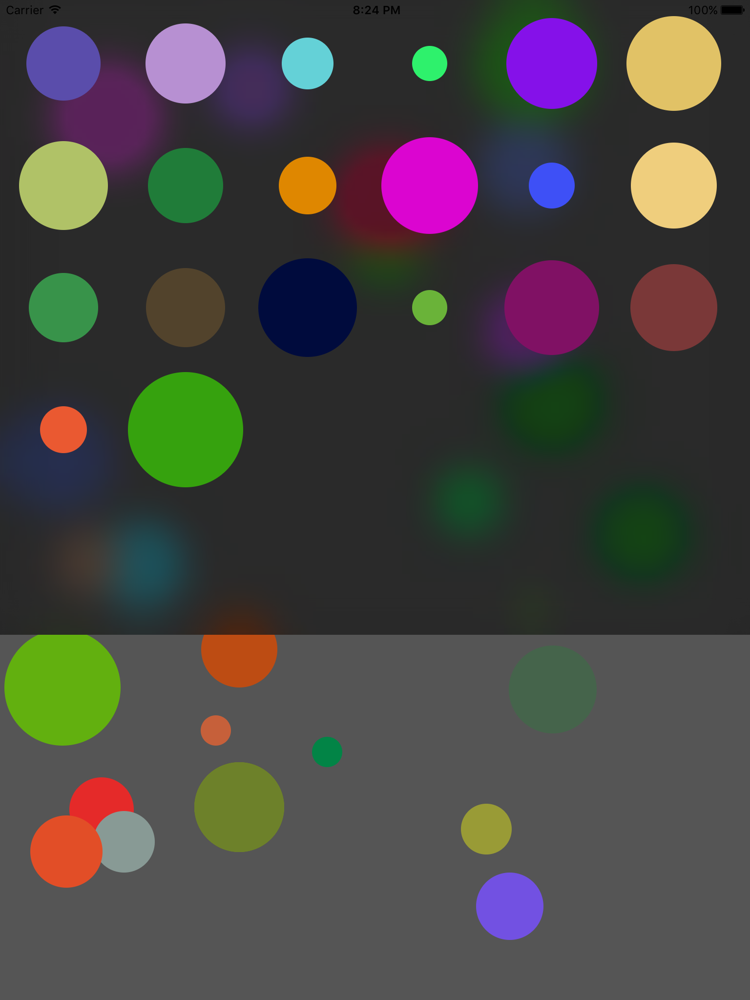

# WWScrollTouchDemo
Sample code for 2014 WWDC session on scroll view and touch handling entitled [Advanced Scrollviews and Touch Handling Techniques](https://developer.apple.com/videos/play/wwdc2014/235/).

Code in session was written in objective-c. Code here is swift 2.2. Sorry for the typo in the project name.
